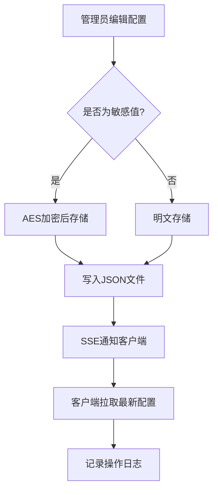
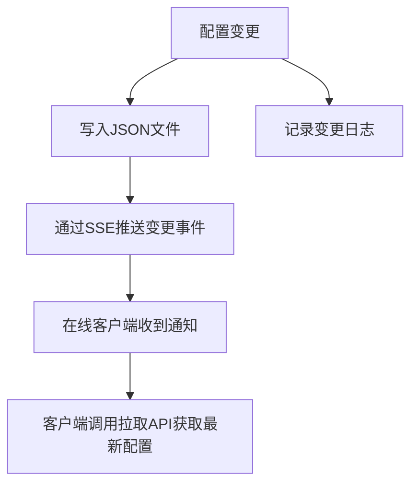

## 1. 产品概述

局域网环境变量与配置中心，面向开发团队提供集中化的配置管理服务。支持多项目、多环境（开发/测试/生产）配置项的统一存储于JSON文件，通过REST API供各服务拉取配置，前端提供可视化编辑、敏感值加密、操作日志审计及配置变更实时通知。

- 解决多项目多环境配置分散、难以统一管理的痛点
- 面向中小型开发团队，提供轻量级、零依赖外部数据库的配置中心方案

## 2. 核心功能

### 2.1 用户角色

| 角色 | 注册方式 | 核心权限 |
|------|----------|----------|
| 管理员 | 默认单用户 | 配置增删改查、加密管理、日志查看、通知推送 |
| 客户端（服务） | API Token 认证 | 拉取配置、接收刷新通知 |

### 2.2 功能模块

1. **仪表盘页**：项目总览、环境状态概览、最近操作日志、客户端在线状态
2. **配置管理页**：按项目/环境分组展示配置项，支持搜索、编辑、新增、删除、批量导入导出
3. **加密管理页**：敏感值加密/解密操作，加密状态标记，密钥管理
4. **操作日志页**：客户端拉取记录、配置变更记录、时间线展示
5. **客户端通知页**：已注册客户端列表、在线状态、手动/自动刷新通知推送

### 2.3 页面详情

| 页面名称 | 模块名称 | 功能描述 |
|----------|----------|----------|
| 仪表盘 | 项目卡片 | 展示所有项目及每个项目的环境数量和配置项数量 |
| 仪表盘 | 最近操作 | 最近10条配置变更和客户端拉取记录 |
| 仪表盘 | 客户端状态 | 在线/离线客户端实时统计 |
| 配置管理 | 项目选择器 | 切换当前操作的项目 |
| 配置管理 | 环境标签页 | 按开发/测试/生产分组展示配置项 |
| 配置管理 | 配置表格 | 键值对列表，支持内联编辑、加密标记、删除 |
| 配置管理 | 新增/编辑弹窗 | 配置项的键、值、描述、是否加密等字段 |
| 配置管理 | 批量操作 | JSON导入导出、批量删除 |
| 加密管理 | 加密值列表 | 展示所有已加密的配置项及其加密状态 |
| 加密管理 | 加密/解密操作 | 对指定配置值执行加密或解密，加密后存储到文件 |
| 操作日志 | 日志列表 | 分页展示所有操作记录，含时间、类型、客户端IP、详情 |
| 操作日志 | 筛选器 | 按时间范围、操作类型、客户端筛选 |
| 客户端通知 | 客户端列表 | 已注册客户端名称、IP、最后心跳时间、在线状态 |
| 客户端通知 | 通知推送 | 配置变更后自动通知，支持手动推送刷新指令 |

## 3. 核心流程

### 3.1 配置管理流程

管理员在前端创建项目和环境 → 添加配置项（键值对）→ 对敏感值标记加密并加密存储 → 客户端通过API拉取配置（解密后返回）→ 配置变更后自动通知客户端刷新

### 3.2 客户端拉取流程

客户端携带Token请求配置API → 服务端验证Token → 返回指定项目和环境的配置（敏感值解密）→ 记录操作日志 → 客户端定时轮询或接收SSE通知刷新

### 3.3 配置变更通知流程

## 4. 用户界面设计

### 4.1 设计风格

- **主色调**：深色主题（#0F172A 深蓝黑底）+ 青绿强调色（#10B981）+ 琥珀警告色（#F59E0B）
- **辅助色**：石板灰（#64748B）用于边框和次要文字
- **按钮风格**：圆角（rounded-lg），主要操作用实心青绿，危险操作用红色，次要操作用轮廓线
- **字体**：JetBrains Mono 用于代码/配置值，Noto Sans SC 用于界面文字
- **布局风格**：左侧固定导航栏 + 右侧内容区，卡片式布局
- **图标风格**：Lucide 线性图标

### 4.2 页面设计概览

| 页面名称 | 模块名称 | UI元素 |
|----------|----------|--------|
| 仪表盘 | 项目卡片 | 深色卡片，悬停发光边框，项目名+环境徽标+配置计数 |
| 仪表盘 | 最近操作 | 时间线列表，左侧圆点颜色区分类型，右侧操作摘要 |
| 仪表盘 | 客户端状态 | 环形进度图显示在线比例，下方客户端名称列表 |
| 配置管理 | 环境标签页 | 胶囊式标签页，选中态带青绿底色 |
| 配置管理 | 配置表格 | 行悬停高亮，加密值显示为星号+锁图标，内联编辑 |
| 配置管理 | 编辑弹窗 | 居中弹窗，毛玻璃背景遮罩，表单字段带验证 |
| 操作日志 | 日志列表 | 斑马纹表格，操作类型彩色徽标，时间格式化显示 |
| 客户端通知 | 客户端列表 | 在线绿点/离线灰点，心跳时间倒计时 |

### 4.3 响应式设计

- 桌面优先设计，最小宽度1024px
- 内容区自适应，导航栏可折叠
- 表格在窄屏下切换为卡片列表

### 4.4 动效设计

- 页面切换：淡入淡出（150ms）
- 配置保存：成功后行闪烁青绿色
- 通知推送：脉冲动画表示信号发送
- 加密/解密：锁图标开合动画
