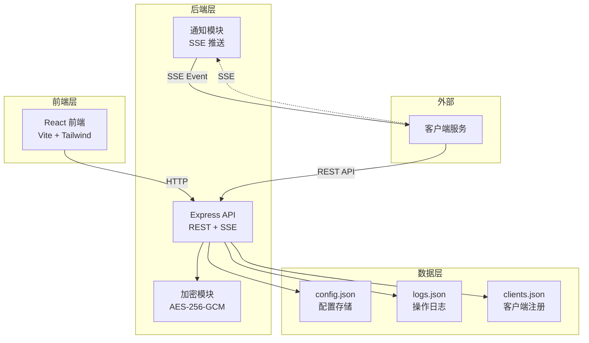
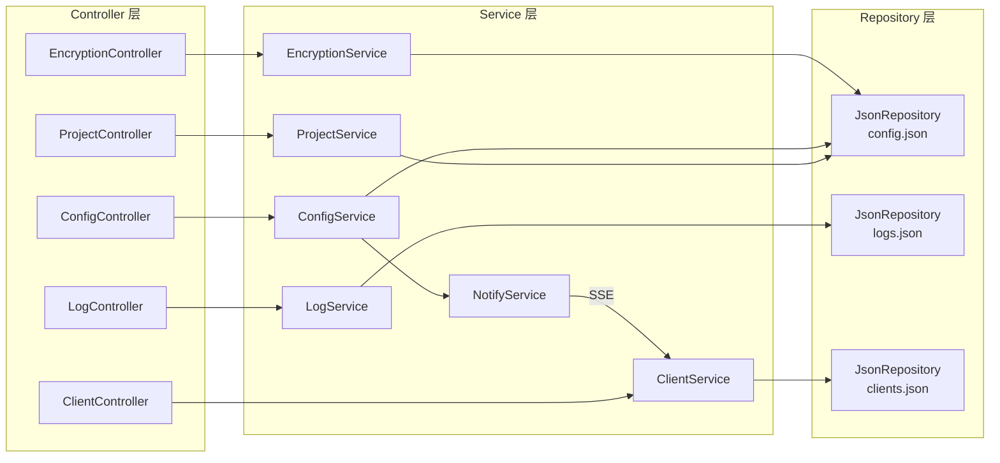
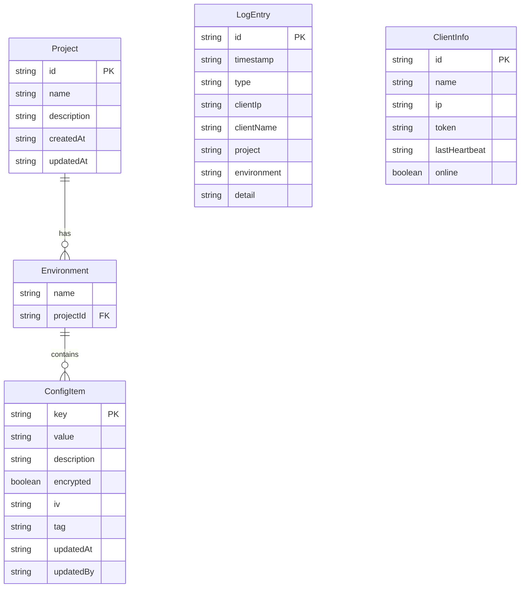

## 1. 架构设计



## 2. 技术说明

- **前端**：React@18 + TailwindCSS@3 + Vite
- **初始化工具**：vite-init
- **后端**：Express@4 + TypeScript (ESM)
- **数据库**：JSON文件存储（无外部数据库依赖）
- **加密**：Node.js 内置 crypto 模块，AES-256-GCM 对称加密
- **通知**：Server-Sent Events (SSE) 实现配置变更推送
- **状态管理**：Zustand

## 3. 路由定义

| 路由 | 用途 |
|------|------|
| `/` | 仪表盘 - 项目总览、最近操作、客户端状态 |
| `/configs` | 配置管理 - 项目/环境配置项编辑 |
| `/encryption` | 加密管理 - 敏感值加密/解密 |
| `/logs` | 操作日志 - 拉取和变更记录 |
| `/clients` | 客户端通知 - 客户端列表与推送 |

## 4. API 定义

### 4.1 配置管理 API

```typescript
interface ConfigItem {
  key: string;
  value: string;
  description: string;
  encrypted: boolean;
  updatedAt: string;
  updatedBy: string;
}

interface Project {
  id: string;
  name: string;
  description: string;
  environments: Environment[];
}

interface Environment {
  name: string;
  configs: ConfigItem[];
}

// GET /api/projects - 获取所有项目
// GET /api/projects/:projectId - 获取项目详情（含所有环境配置）
// POST /api/projects - 创建项目
// PUT /api/projects/:projectId - 更新项目
// DELETE /api/projects/:projectId - 删除项目

// GET /api/projects/:projectId/envs/:envName/configs - 获取环境配置
// PUT /api/projects/:projectId/envs/:envName/configs - 批量更新配置项
// POST /api/projects/:projectId/envs/:envName/configs - 新增配置项
// DELETE /api/projects/:projectId/envs/:envName/configs/:key - 删除配置项
```

### 4.2 客户端拉取 API

```typescript
interface PullRequest {
  project: string;
  environment: string;
  token: string;
}

interface PullResponse {
  configs: Record<string, string>;
  version: string;
  pulledAt: string;
}

// POST /api/pull - 客户端拉取配置（敏感值自动解密）
// GET /api/pull/:project/:env?token=xxx - GET方式拉取配置
```

### 4.3 加密 API

```typescript
// POST /api/encrypt/:projectId/:envName/:key - 加密指定配置值
// POST /api/decrypt/:projectId/:envName/:key - 解密指定配置值
// GET /api/encryption/status - 获取所有加密配置项状态
```

### 4.4 操作日志 API

```typescript
interface LogEntry {
  id: string;
  timestamp: string;
  type: "pull" | "change" | "encrypt" | "decrypt" | "client_register" | "notify";
  clientIp: string;
  clientName: string;
  project: string;
  environment: string;
  detail: string;
}

// GET /api/logs - 获取操作日志（支持分页和筛选）
// GET /api/logs?type=pull&project=xxx&from=xxx&to=xxx
```

### 4.5 客户端与通知 API

```typescript
interface ClientInfo {
  id: string;
  name: string;
  ip: string;
  token: string;
  lastHeartbeat: string;
  online: boolean;
}

// GET /api/clients - 获取所有注册客户端
// POST /api/clients - 注册新客户端
// DELETE /api/clients/:clientId - 删除客户端
// POST /api/clients/:clientId/heartbeat - 客户端心跳

// GET /api/events - SSE 事件流，配置变更通知
// POST /api/notify - 手动推送刷新通知给所有/指定客户端
```

## 5. 服务端架构图



## 6. 数据模型

### 6.1 数据模型定义



### 6.2 数据存储结构 (config.json)

```json
{
  "encryptionKey": "base64-encoded-aes-key",
  "projects": [
    {
      "id": "proj_001",
      "name": "用户服务",
      "description": "用户中心微服务配置",
      "createdAt": "2026-01-01T00:00:00Z",
      "updatedAt": "2026-01-01T00:00:00Z",
      "environments": [
        {
          "name": "development",
          "configs": [
            {
              "key": "DB_HOST",
              "value": "localhost",
              "encrypted": false,
              "description": "数据库地址",
              "updatedAt": "2026-01-01T00:00:00Z",
              "updatedBy": "admin"
            },
            {
              "key": "DB_PASSWORD",
              "value": "encrypted:base64string",
              "encrypted": true,
              "iv": "base64iv",
              "tag": "base64tag",
              "description": "数据库密码",
              "updatedAt": "2026-01-01T00:00:00Z",
              "updatedBy": "admin"
            }
          ]
        }
      ]
    }
  ]
}
```
